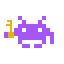

  

<h1 align="center">Game Vault</h1>

Your game library, rated your way.

Game Vault is a vanilla JavaScript, HTML and CSS video game tracker: add the games you've played or want to play, rate them across multiple aspects, rank them into tier lists and top-10s, and build "About me" boards around your favorites — all in a retro pixel-art interface.

Built as a [The Odin Project](https://www.theodinproject.com/) project, originally a TV show watchlist, later reworked into a game vault.

## Features

### Library
- **Game catalog** — add, remove, and track each game's status (Backlog / Playing / Completed), with favorites and free-text tags.
- **Bulk add** — paste a list of titles, one per line; each is looked up on IGDB automatically and added with whatever was found.
- **IGDB autofill** — type a title (or pick from a live type-ahead) and the form pulls a description, cover art, genre and developer from the [IGDB](https://api-docs.igdb.com/) games database. Everything stays editable before you save.
- **Multi-aspect ratings** — rate each game on Gameplay, Story, Graphics, Music and Enjoyment, plus any custom aspect you want to add. The final score is the average of every rating entered; unrated games get their own section so there's always an obvious "rate this next" pile.
- **Search, filters & collections** — free-text search, status/favorites filters, genre chips, and named collections (folders) a game can belong to.
- **Per-game accent color** — every card can have its own accent color pulled from the app's palette.

### Detail view
Click any card to open a full panel: edit every field, rate it, write a review, manage its tags and collections, and browse **related games** (pulled live from IGDB by shared genres/tags). An **awards** button shows everywhere else that game is featured — a tier placement, an About me topic, a top-list rank — with a one-click jump to it.

### Tier maker
Build S/A/B/C (fully custom, add/rename/reorder/recolor) tier boards. Games come from a search-and-select tray — by name, genre, or platform, searching your library first and IGDB second — that you drag out into tiers. Multiple boards supported.

### About me
A wall of prompt cards ("Favorite game of all time", "Favorite villain", "Guilty pleasure"…) — start from an 18-prompt template or build your own — each holding one game with its own subtitle, description and color.

### My top lists
Pick a subject ("Best endings", "Most replayed") and a size up to 100; every rank exists as its own reorderable row from the start. Multiple lists supported.

### Backup & data
- **Export / Import** — the entire vault (library, collections, tier lists, About me, top lists) as a single JSON file, for backup or moving between devices.
- **Export as image** — save a tier board, top list or About me board as a PNG, rendered from the real on-screen layout.
- **Reset to template / Clear all data** — start over from the bundled example library or wipe everything.

### Everywhere
Local persistence via `localStorage` (the small backend only keeps the IGDB credentials off the client, it never stores your data), a fully responsive layout down to mobile, and a pixel-art theme throughout — animated background, notch-cut panels, custom cursor tilt on cover art.

## Usage

1. Copy `.env.example` to `.env` and fill in `IGDB_CLIENT_ID` / `IGDB_CLIENT_SECRET` — free from a [Twitch Developer](https://dev.twitch.tv/console/apps) app (IGDB runs on Twitch's identity platform).
2. Run `npm start` (plain Node, no dependencies to install) and open the printed local URL.
3. Click **Add game**, type the title, then move focus away from the field (or pick a suggestion): if IGDB has a matching game, the description, image, genre and developer fill in automatically.
4. Click a card to open its detail view — rate it, tag it, edit its info, or check what's featuring it via the awards button.
5. Switch views from the sidebar: **Tier maker**, **About me** and **My top lists** each work off the same library.
6. Use **Save options** in the sidebar footer to export a backup, import one, or reset the vault.

## Project structure

| File | Role |
|---|---|
| `index.html` | Page markup: shell, sidebar, all view containers |
| `style.css` | Visual theme (purple pixel-art palette, notch shapes, responsive layout) |
| `template-vault.js` | Bundled starter library — seeds a first visit and "Reset to template" |
| `script-ui.js` | Shared UI kit: escaping, dialogs, confirm/toast, icons, view switching |
| `script-store.js` | `localStorage` read/write, vault keys, export/import, clear/reset |
| `script.js` | Library core: data model, CRUD, grid rendering, bulk add, awards tracking |
| `script-enhancements.js` | Game status, card color/cover, pixel-outline sizing |
| `script-filter.js` | Search bar, status/genre filters, collections (folders) |
| `script-picker.js` | Shared "choose games" modal and single-title type-ahead, used by tiers/About me/top lists |
| `script-detail.js` | The detail (focus) view: editing, tags, related games, awards popover |
| `script-wiki.js` | Integration with the IGDB games API (via the `/api/igdb` proxy) |
| `script-ratings.js` | Multi-aspect rating system, custom aspects, average score |
| `script-ranking.js` | Sortable ranking helpers |
| `script-collections.js` | Shared "named collection" widget (board picker + CRUD) behind tiers/About me/top lists |
| `script-tiers.js` | Tier maker view |
| `script-about.js` | About me view |
| `script-tops.js` | My top lists view |
| `script-export.js` | Export a board/list as a PNG (html2canvas) |
| `script-fx.js` | Shared visual effects: animated pixel field, cursor-tilt on covers |
| `script-background.js` | Ambient background wiring for the pixel field |
| `server.js` | Local dev server: serves the static files and proxies `/api/igdb` to IGDB with the Twitch app token attached server-side |
| `api/igdb.js` | Same proxy, as a Vercel serverless function for deployment |

## Deploying

The IGDB credentials must never reach the browser, and IGDB's API has no CORS support at all — a plain static host (GitHub Pages included) can't call it directly, with or without hiding the key. The simplest free option:

1. Push this repo to GitHub.
2. Import it into [Vercel](https://vercel.com) (free tier, no card required) — it auto-detects the static files and the `api/igdb.js` function.
3. In the Vercel project's Environment Variables, add `IGDB_CLIENT_ID` and `IGDB_CLIENT_SECRET`.
4. Deploy. No code changes needed — `api/igdb.js` is the exact same proxy `server.js` runs locally.

## Technical note

No external npm dependencies for the app itself — `server.js` uses only Node's built-in `http`/`fs`, and the frontend is plain HTML/CSS/JS plus Google Fonts and a single CDN script (`html2canvas`, for the PNG export). The only external service is IGDB, called exclusively through this app's own `/api/igdb` proxy so the credentials stay server-side. The proxy also gets/caches the OAuth app token itself (Twitch's client-credentials grant) and scrubs it from anything echoed back before the response reaches the browser.
